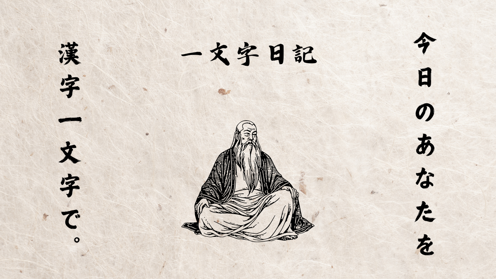

# プロジェクト名 : 一文字日記

## サービス概要
漢字一文字で毎日を記録する日記アプリです。カレンダーに日付ごとに漢字を表示することで普通の日記アプリより分かりやすく一カ月の日記を振り返ることができます。また毎日の気分を表す円グラフ機能も実装されており一カ月の気分を視覚的に確認できます。

## このサービスへの思い・作りたい理由
その日の気分だけ選択して簡単に記録できる日記アプリを使用していたことがあります。このアプリは確かにシンプルで簡単なのですが日記を書くことで得られる自己表現をする欲求が満たされないように感じてすぐに飽きてしましました。そこでこのアプリと何かを組み合わせて日記本来の良さが出せないか考えました。そのアイディアの中で年末に京都の清水寺で漢字一文字を決めるイベントから着想を得て、毎日漢字一文字を記し、気分を選択する機能と組み合わせることで新しい視点の日記アプリが作れるのではないかと思い作成に至りました。

## ユーザー層について
既存の日記アプリに不満を感じている人、日記を書いているが振り返るのが面倒な人、子どもの記録をつけたい人

## サービスの利用イメージ
* 主にこのアプリはスマートフォンでの使用を想定しています。PCの場合、レイアウトが崩れる可能性があります。
* ユーザーは登録した後、ログインをします。
* ヘッダーの日記作成ボタンから気分、一文字、メモ、日付を選択して日記を作成できます。
また、カレンダーの日付をクリックしたらその日の日記を作成できます。
* カレンダーから作成された漢字一文字を選択したら詳細画面に移動し編集、削除をできます。またxへのシェア機能もあります。
* ヘッダーの円グラフボタンを選択したら円グラフ機能で一カ月の気分を確認できます。
* ヘッダーの通知設定ボタンを選択したらLINEで登録、LINEの公式アカウントに登録します。通知にチェックすることで21時に日記を書くように案内するLINEを送ることができます。

## ユーザーの獲得について
Xでの活用、RUNTEQコミュニティでの拡散、友人、知人への紹介

## サービスの差別化ポイント・押しポイント
- カレンダーによる直感的な日記の振り返り
  - 気分によって選択された色の漢字一文字がカレンダーに表示されることで一カ月の出来事、気分の移り変わり、傾向を確認できる。
- シンプルな操作
  - シンプルで分かりやすいUIによって、簡単に一文字日記の機能を使うことができます。
- LINEによる通知機能
  - LINEログイン、LINE公式アカウントに登録することで21時に日記を書くようにユーザーに促すLINEメッセージ通知を送ることで日記の継続利用に役立ちます。

## 機能候補
### MVPリリース
- 会員登録機能
- ログイン機能
- 日記作成機能(メモ機能含む)
- 日記詳細機能
- 日記編集機能
- 日記一覧機能(カレンダー表示)
- 気分を選択する機能
- 気分によって文字が変わる機能
### 本リリース
- Googleログイン機能
- LINEログイン機能
- 円グラフ機能
- LINE通知機能
- 静的OGPシェア機能(twitter)
- GithubAcitonsによるCI/CD
- 独自ドメイン
- パスワード変更機能
### 今後実装予定の機能
- 動的OGPシェア機能
- LINE通知機能(時間選択)
## 機能の実装方針予定

| カテゴリー | 技術 |
| ---- | ---- |
| 言語 | Ruby3.3.4, JavaScript |
| フレームワーク | Ruby on Rails 7.1.3.4　|
| 開発環境 | Docker |
| インフラ | fly.io |
| データベース | PostgreSQL,redis |
| css | TailwindCSS |
| バージョン管理ツール | Github |
| その他 | LINEMessageAPI,turbo-rails,devise,omiauth, omiauth-line,omiauth-google-oauth2,sidekiq,chartkick,neta-tags,mini_magick |

## ER図

## 画面遷移図
https://www.figma.com/design/GSxDVtIGLkvNtni0xAGGXB/%E7%84%A1%E9%A1%8C?node-id=0-1&t=MUnhQMJX1NpbUIQt-1
